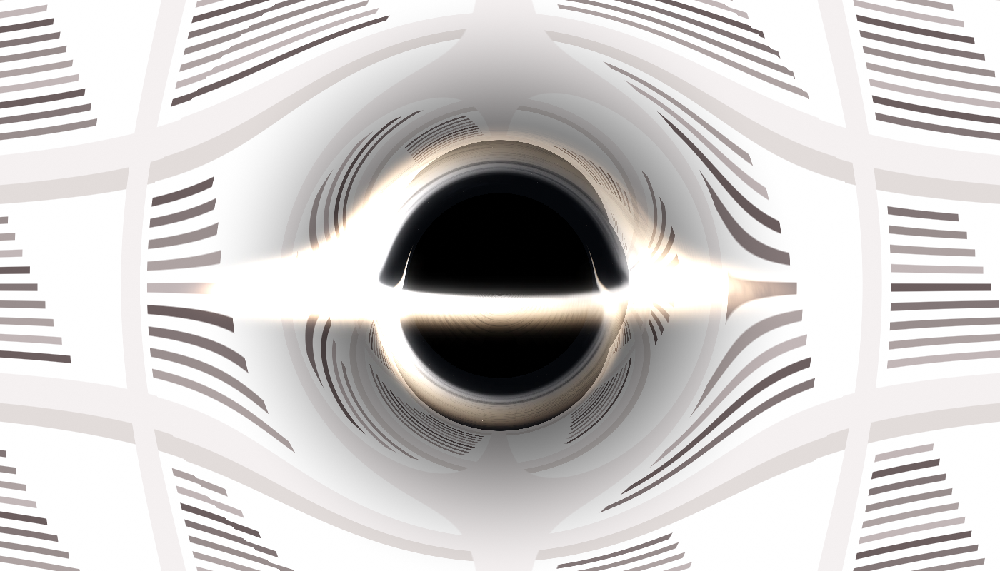
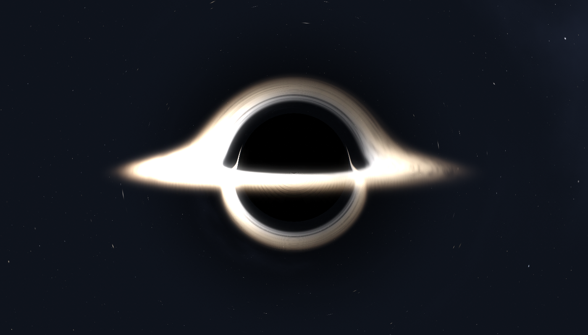
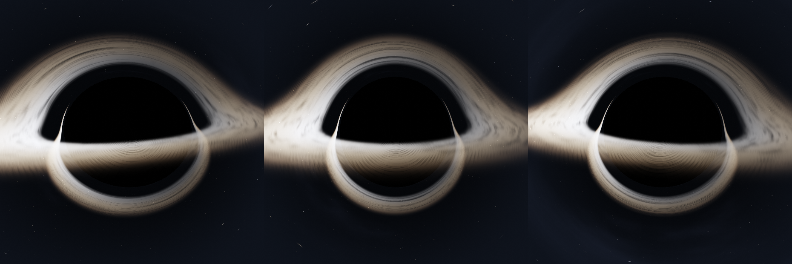

# Cosmic Drift

Two macOS experiments that render a Schwarzschild black hole by integrating null
geodesics in a single Metal fragment pass. Nothing is painted on: the shadow, the
photon ring, the lensed background and the multiple images of the accretion disk
all fall out of the same integration.

## [EventHorizon](EventHorizon/) — a break timer

A menu bar app. When the work timer runs out, a black hole crosses your screen,
bending and swallowing whatever it passes over, then hands your desktop back.
The screen is captured live with ScreenCaptureKit and used as the plane the
geodesics land on, so those really are your windows being bent.

The warp is tapered to a finite reach, so only the neighbourhood of the hole is
touched — everything else stays untouched and live, not a delayed copy. Moving
the mouse ends a break.

Configurable interval, crossing direction, animation speed and loop.

## [ScreenSaver](ScreenSaver/) — a real `.saver`

The same renderer as an installable macOS screensaver, against a procedural
starfield instead of your desktop.

## It is a real object, not a sprite

The camera's forward axis is fixed at the screen centre, and the hole is placed
by moving the camera sideways rather than by shifting the image. So it genuinely
turns as it crosses: the disk foreshortens, the lensing goes asymmetric, and the
Doppler-brightened side swaps.

Below are three renders **at the same instant**, differing only in where the hole
sits on screen. If the effect were a picture being translated, these would be
byte-identical. They differ by 17–24 levels out of 255.

## What is modelled

- Null geodesics integrated as `u'' = -u + 1.5·u²`, with the step size scaled by
  impact parameter so grazing rays are resolved and far-field rays cost almost
  nothing
- An accretion disk with real thickness, integrated as a slab along the ray
- Keplerian orbital velocity, relativistic Doppler beaming, gravitational
  redshift, and an `r^-3/4` temperature profile driving a blackbody ramp
- Turbulence that mixes a sheared layer with a solid-body one, so the gas forms
  filaments without winding into concentric rings
- A bloom pass fed from a separate emission target, so the disk glows but bright
  desktop content never does

## Building

Each directory has its own `build.sh` and README. Both need only the Xcode
Command Line Tools — the Metal shaders are compiled at load time from source,
because the offline `metal` compiler ships only with full Xcode.
